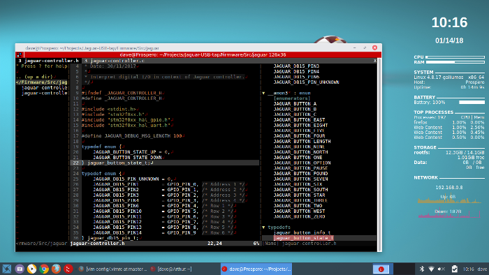

# vim-config

My .vimrc preferences file. This config is checked out and automatically installed by running my [install-packages script](https://github.com/dgrubb/install-package) which also takes care of the prerequisites.

## Features

Enables the following:

* Auto-completion.
* Syntax checking and linting.
* File explorer sidebar (NerdTree).
* File code layout sidebar (TagBar).
* Shortcuts for opening and navigating tabs.
* My favourite colour scheme. :)
* Sets tab-width of 4 spaces and shortcut for toggling between tabs and spaces and sets a shortcut for clearing trailing whitespace.
* Highlights 80-character line length.
* Displays tabs, newlines, highlights current line, syntax highlighting and line numbers.

## Requirements

* The NodeJS runtime and the package JSHint is required for JavaScript linting and tern code navigation.
* exuberant-ctags is helpful for everything else.
* Python development headers are necessary for compiling YouCompleteMe plugin. 
